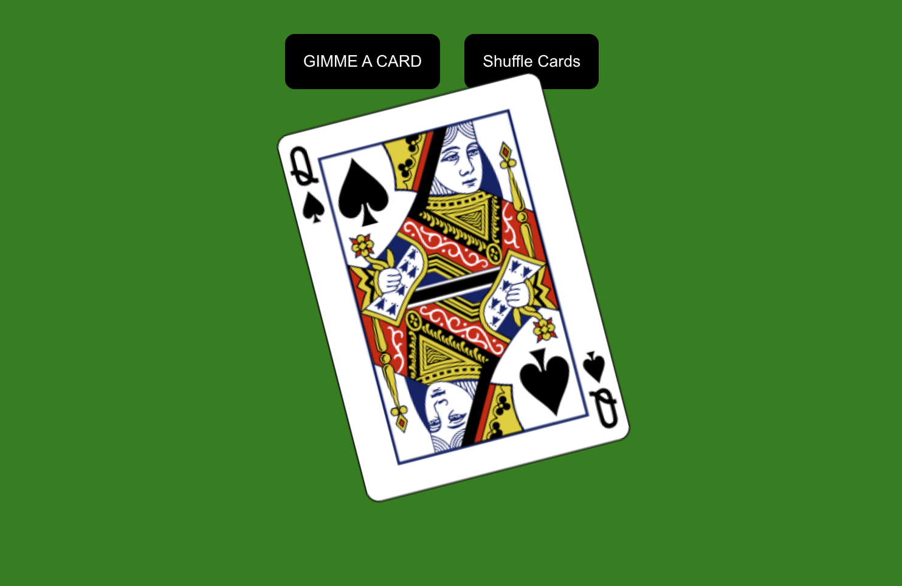

[![LinkedIn][linkedin-shield]][linkedin-url]

<h1 align="center">React-Effects-Refs</h1>

  

    A react app, using DeckOfCardsAPI and the useEffect hook, plus some fun css!
     
    <a href="https://github.com/calebthewood/express-jobly/issues">Request Feature</a>
  

https://www.loom.com/share/4cdf81084bbc4db6ac5b26b85058a31d

<!-- TABLE OF CONTENTS -->

  
Table of Contents

  <ol>
    <li>
      <a href="#about-the-project">About The Project</a>
      <ul>
        <li><a href="#built-with">Built With</a></li>
      </ul>
    </li>
    <li>
      <a href="#getting-started">Getting Started</a>
    </li>
    <li><a href="#usage">Usage</a></li>
    <li><a href="#roadmap">Roadmap</a></li>
    <li><a href="#contributing">Contributing</a></li>
    <li><a href="#contact">Contact</a></li>
    <li><a href="#acknowledgments">Acknowledgments</a></li>
    <li><a href="#create-react-app">Create React App</a></li>
  </ol>

<!-- ABOUT THE PROJECT -->
## About The Project

### Built With

* [ReactJS](https://reactjs.org/)
* [React-DOM](https://reactjs.org/docs/react-dom.html)
* [React Testing Library](https://testing-library.com/docs/react-testing-library/intro/)
* [AXIOS](https://axios-http.com/docs/intro)
* [deckofcards API](http://deckofcardsapi.com/)

(<a href="#top">back to top</a>)

<!-- GETTING STARTED -->
## Getting Started

- On loading, useEffect makes an AJAX request to create a new deck, and generate a unique deckId.
- The "Gimme a Card" button makes AJAX request to get a new card using the deckId.
- The "Shuffle" button clears the dom of all cards, and sends an AJAX request to shuffle the deck.

(<a href="#top">back to top</a>)

<!-- ROADMAP -->
## Roadmap

- [ ] Improve button styling
- [ ] Adjust CSS to make cards "stack"
- [ ] Add a title section

(<a href="#top">back to top</a>)

<!-- CONTRIBUTING -->
## Contributing

If you have a suggestion that would make this better, please fork the repo and create a pull request. You can also simply open an issue with the tag "enhancement".
Don't forget to give the project a star! Thanks again!

1. Fork the Project
2. Create your Feature Branch (`git checkout -b feature/AmazingFeature`)
3. Commit your Changes (`git commit -m 'Add some AmazingFeature'`)
4. Push to the Branch (`git push origin feature/AmazingFeature`)
5. Open a Pull Request

(<a href="#top">back to top</a>)

<!-- CONTACT -->
## Contact

Questions? - I'm on twitter [@calebthewood](https://twitter.com/calebthewood) - or email: calebwood.cs@gmail.com

Check out my [personal site!](https://www.calebwood.dev/)

<!-- ACKNOWLEDGMENTS -->
## Acknowledgments

* [Rithm School](https://www.rithmschool.com/)
* [Deck of Cards API](http://deckofcardsapi.com/)

(<a href="#top">back to top</a>)

<!-- MARKDOWN LINKS & IMAGES -->
<!-- https://www.markdownguide.org/basic-syntax/#reference-style-links -->
[contributors-shield]: https://img.shields.io/github/contributors/calebthewood/react-productiv.svg?style=for-the-badge
[contributors-url]: https://github.com/calebthewood/react-productiv/graphs/contributors

[issues-shield]: https://img.shields.io/github/issues/calebthewood/react-productiv.svg?style=for-the-badge
[issues-url]: https://github.com/calebthewood/react-productiv/issues
[linkedin-shield]: https://img.shields.io/badge/-LinkedIn-black.svg?style=for-the-badge&logo=linkedin&colorB=555
[linkedin-url]: https://linkedin.com/in/caleb-wood-440b37168

## Create React App

This project was bootstrapped with [Create React App](https://github.com/facebook/create-react-app).

## Available Scripts

In the project directory, you can run:

### `npm start`

Runs the app in the development mode.\
Open [http://localhost:3000](http://localhost:3000) to view it in your browser.

The page will reload when you make changes.\
You may also see any lint errors in the console.

### `npm test`

Launches the test runner in the interactive watch mode.\
See the section about [running tests](https://facebook.github.io/create-react-app/docs/running-tests) for more information.

### `npm run build`

Builds the app for production to the `build` folder.\
It correctly bundles React in production mode and optimizes the build for the best performance.

The build is minified and the filenames include the hashes.\
Your app is ready to be deployed!

See the section about [deployment](https://facebook.github.io/create-react-app/docs/deployment) for more information.

### `npm run eject`

**Note: this is a one-way operation. Once you `eject`, you can't go back!**

If you aren't satisfied with the build tool and configuration choices, you can `eject` at any time. This command will remove the single build dependency from your project.

Instead, it will copy all the configuration files and the transitive dependencies (webpack, Babel, ESLint, etc) right into your project so you have full control over them. All of the commands except `eject` will still work, but they will point to the copied scripts so you can tweak them. At this point you're on your own.

You don't have to ever use `eject`. The curated feature set is suitable for small and middle deployments, and you shouldn't feel obligated to use this feature. However we understand that this tool wouldn't be useful if you couldn't customize it when you are ready for it.

## Learn More

You can learn more in the [Create React App documentation](https://facebook.github.io/create-react-app/docs/getting-started).

To learn React, check out the [React documentation](https://reactjs.org/).

### Code Splitting

This section has moved here: [https://facebook.github.io/create-react-app/docs/code-splitting](https://facebook.github.io/create-react-app/docs/code-splitting)

### Analyzing the Bundle Size

This section has moved here: [https://facebook.github.io/create-react-app/docs/analyzing-the-bundle-size](https://facebook.github.io/create-react-app/docs/analyzing-the-bundle-size)

### Making a Progressive Web App

This section has moved here: [https://facebook.github.io/create-react-app/docs/making-a-progressive-web-app](https://facebook.github.io/create-react-app/docs/making-a-progressive-web-app)

### Advanced Configuration

This section has moved here: [https://facebook.github.io/create-react-app/docs/advanced-configuration](https://facebook.github.io/create-react-app/docs/advanced-configuration)

### Deployment

This section has moved here: [https://facebook.github.io/create-react-app/docs/deployment](https://facebook.github.io/create-react-app/docs/deployment)

### `npm run build` fails to minify

This section has moved here: [https://facebook.github.io/create-react-app/docs/troubleshooting#npm-run-build-fails-to-minify](https://facebook.github.io/create-react-app/docs/troubleshooting#npm-run-build-fails-to-minify)
